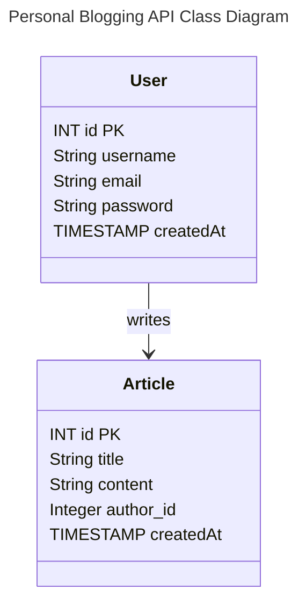

```mermaid
---
title: Personal Blogging API Class Diagram
---
classDiagram
    class User {
        INT id PK
        String username
        String email
        String password
        TIMESTAMP createdAt
    }

    class Article {
        INT id PK
        String title
        String content
        Integer author_id
        TIMESTAMP createdAt
    }

    User --> Article : writes
```
